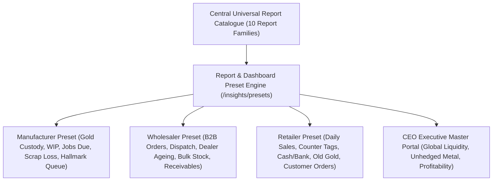

# ORNEXA — REPORT & DASHBOARD PRESET MASTER
**Authoritative Architectural Specification for Business-Mode-Driven Intelligence Reports, Executive Dashboards, and Metric Presets**
*Version: 3.1.0 (Approved Source of Truth)*
*Last Updated: August 2026*

---

## 1. Intelligence Presets Philosophy

### 1.1 The Core Operating Principle
> **"REPORTS AND DASHBOARDS AUTOMATICALLY HIGHLIGHT METRICS CRITICAL TO THE SELECTED BUSINESS MODEL, WHILE PRESERVING ON-DEMAND ACCESS TO THE FULL REPORT CATALOGUE."**
>
> A manufacturer needs instant visibility over artisan metal custody and furnace recovery; a wholesaler tracks dispatch velocity and dealer credit ageing; a retail jeweller monitors daily cash drawers and fast-moving showroom tags.

---

## 2. Business Mode Intelligence Presets

### 2.1 Jewellery Manufacturer Intelligence Bundle
- **Top Executive Dashboard Cards:**
  - `Total Fine Gold Outside at Karigar Benches (Grams)`
  - `Active Manufacturing Jobs in Progress (WIP)`
  - `Overdue Promised Delivery Jobs`
  - `Pending QC & Hallmark (HUID) Queue`
- **Default Featured Reports:**
  1. *Karigar Gold Custody & Ageing Statement*
  2. *Workshop WIP Job Register*
  3. *Melting & Assaying Recovery Analysis*
  4. *Karigar Hisab & Wastage Settlement Register*
  5. *Outside Processing (Mina / Polish) Custody Ledger*

---

### 2.2 Jewellery Wholesaler Intelligence Bundle
- **Top Executive Dashboard Cards:**
  - `Total Unfulfilled B2B Dealer Orders`
  - `Finished Inventory in Warehouse Trays (Grams & Pcs)`
  - `Total Dealer Receivables (>30 / >60 Days Overdue)`
  - `Today's Dispatched Goods Valuation`
- **Default Featured Reports:**
  1. *Dealer-Wise Outstanding & Ageing Schedule*
  2. *Bulk Finished Tag Stock Status (by Box/Tray)*
  3. *Order Booking & Dispatch Velocity Report*
  4. *Wholesale B2B Sales Tax Register*
  5. *Fast-Moving Design & Collection Analytics*

---

### 2.3 Retail Jeweller Intelligence Bundle
- **Top Executive Dashboard Cards:**
  - `Today's Showroom Gross Sales (₹ & Grams Sold)`
  - `Ready Tagged Stock in Showroom Counters`
  - `Daily Drawer Cash & UPI Collection Balance`
  - `Active Customer Bespoke Orders & Repair Intake`
- **Default Featured Reports:**
  1. *Daily Day Book & Cash/Bank Register*
  2. *Showroom Tagged Stock Balance (by Category & Karat)*
  3. *Retail GST Sales Register (GSTR-1 Ready)*
  4. *Old Gold Buyback & Scrap Inward Register*
  5. *Customer Repair & Custom Order Tracking Sheet*
