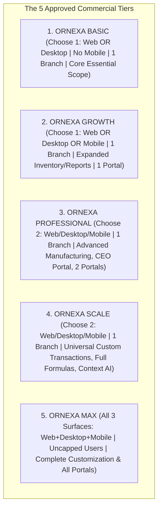

# ORNEXA — SAAS ENTITLEMENT, PLAN TIERS & BILLING MASTER
**Authoritative Architectural Specification for Commercial Plan Tiers, Device Entitlements, Namespaces, AMC Renewals, and Billing Infrastructure**
*Version: 3.2.0 (Approved Source of Truth)*
*Last Updated: August 2026*

---

## 1. Commercial Architecture: The 5 Approved Plan Tiers

### 1.1 The Core Operating Principle
> **"ONE PLATFORM. DIFFERENT COMMERCIAL ENTITLEMENTS. ONE AUTHORITATIVE DATA SOURCE. NO PRODUCT FORKS."**
>
> All tenants run on the same shared PostgreSQL schema and double-entry accounting engine. Commercial tiers configure feature availability, device surface access, and operational quotas via **cryptographically verified entitlement tokens**.
>
> **PRICING POLICY:** Pricing amounts, AMC rates, setup fees, and discount percentages are **never hardcoded** in source code. They are configured dynamically by Platform Owners in the Plan Builder.



---

## 2. Comprehensive Plan Feature & Entitlement Matrix

| Plan Tier | Client Device Surface Entitlement | Included Branches | User Quota Architecture | Core Included Capabilities | External Portals & AI |
|---|---|:---:|---|---|---|
| **ORNEXA BASIC** | **Choose 1:**<br>`client.web` **OR** `client.desktop`<br>*(Mobile strictly excluded)* | 1 Base Branch | Configurable Seat Cap | Standard double-entry accounting, gold/fine gold traceability, basic stock, standard receipts/invoices, essential compliance | ❌ No Portals<br>❌ No CEO Portal<br>❌ No AI / Automation |
| **ORNEXA GROWTH** | **Choose 1:**<br>`client.web` **OR** `client.desktop` **OR** `client.mobile` | 1 Base Branch | Configurable Seat Cap | Basic tier plus expanded stock tracking, multi-category inventory, data imports, expanded configuration, standard documents | 1 Standard Portal<br>❌ No CEO Portal<br>❌ No Cloud AI |
| **ORNEXA PROFESSIONAL**| **Choose 2:**<br>`Web + Desktop` \| `Web + Mobile` \| `Desktop + Mobile` | 1 Base Branch | Configurable Seat Cap | Growth tier plus advanced manufacturing, Party 360, worker/outside gold books, QC/Hallmark/Refinery, 10 document templates, print profiles, standard automation | 2 Standard Portals<br>✅ CEO Portal<br>*(Cloud AI/WABA metered)* |
| **ORNEXA SCALE** | **Choose 2:**<br>`Web + Desktop` \| `Web + Mobile` \| `Desktop + Mobile` | 1 Base Branch | Configurable Seat Cap | Professional tier plus Universal Custom Transaction Engine, Full Formula Engine, Workflow Designer, Advanced Approvals, Report Builder, Config Versioning & Rollback, Advanced Migration/Audit | Advanced Portals<br>✅ CEO Portal<br>✅ Local/Context AI included |
| **ORNEXA MAX** | **All 3 Included:**<br>`Web + Desktop + Mobile` | 1 Base Branch *(Add-ons available)* | **Uncapped / Fair-Use** *(No hard user limit)* | Full Hybrid Manufacturing + Wholesale + Retail, Universal Custom Transactions/Fields/Masters/Formulas/Workflows/Documents/Reports/Portals, Advanced Security/Audit/Backup | All Standard Portals<br>✅ Full CEO Portal<br>✅ Context AI + Framework |

---

## 3. Namespaced Entitlement Token Architecture

Entitlements follow clean hierarchical namespaces evaluated across API gateways, RPC functions, and client routers:

```
┌─────────────────────────────────────────────────────────────────────────────┐
│                       ORNEXA ENTITLEMENT NAMESPACES                         │
├─────────────────────────────────────────────────────────────────────────────┤
│ 📱 CLIENT SURFACES:                                                         │
│   • client.web                 • client.desktop             • client.mobile │
│                                                                             │
│ 🏢 BUSINESS MODES:                                                          │
│   • business.manufacturing     • business.wholesale         • business.retail│
│   • business.hybrid                                                         │
│                                                                             │
│ 🚪 EXTERNAL & EXECUTIVE PORTALS:                                            │
│   • portal.customer            • portal.karigar             • portal.supplier│
│   • portal.ceo                                                              │
│                                                                             │
│ ⚡ PLATFORM & CUSTOMIZATION ENGINES:                                        │
│   • feature.custom_transaction • feature.custom_formula     • feature.api   │
│   • feature.workflow_designer  • feature.report_builder     • feature.audit │
│   • feature.automation         • feature.config_rollback    • feature.backup│
│                                                                             │
│ 🧠 INTELLIGENCE & COMMUNICATIONS:                                           │
│   • feature.context_ai (Local/Deterministic) • feature.cloud_ai (Metered LLM│
│   • feature.whatsapp_waba (Meta API Partner)                                │
│                                                                             │
│ 📊 SCALE QUOTAS:                                                            │
│   • branch.base_limit = 1      • branch.additional_count = N                │
│   • quota.users = N            • quota.storage_gb = N                       │
└─────────────────────────────────────────────────────────────────────────────┘
```

---

## 4. PostgreSQL Commercial & Subscription Schema

```sql
-- 1. Commercial Plan Catalogue (Versioned)
CREATE TABLE public.commercial_plans (
    id UUID PRIMARY KEY DEFAULT gen_random_uuid(),
    code TEXT NOT NULL, -- 'ORNEXA_BASIC', 'ORNEXA_GROWTH', 'ORNEXA_PRO', 'ORNEXA_SCALE', 'ORNEXA_MAX'
    version INTEGER NOT NULL DEFAULT 1,
    name TEXT NOT NULL,
    description TEXT,
    allowed_device_choices INTEGER NOT NULL DEFAULT 1, -- 1 for Basic/Growth, 2 for Pro/Scale, 3 for Max
    mobile_allowed BOOLEAN NOT NULL DEFAULT true, -- False for Basic
    user_limit INTEGER, -- NULL for Max (Uncapped/Fair-use)
    base_branch_limit INTEGER NOT NULL DEFAULT 1,
    included_entitlements JSONB NOT NULL DEFAULT '[]'::jsonb,
    is_active BOOLEAN NOT NULL DEFAULT true,
    created_at TIMESTAMPTZ NOT NULL DEFAULT clock_timestamp(),
    UNIQUE(code, version)
);

-- 2. Tenant Subscriptions (Stores Purchased Plan Version)
CREATE TABLE public.tenant_subscriptions (
    id UUID PRIMARY KEY DEFAULT gen_random_uuid(),
    tenant_id UUID NOT NULL REFERENCES public.tenants(id) ON DELETE RESTRICT,
    plan_id UUID NOT NULL REFERENCES public.commercial_plans(id) ON DELETE RESTRICT,
    subscription_status TEXT NOT NULL DEFAULT 'ACTIVE', -- 'TRIAL', 'ACTIVE', 'PAST_DUE', 'SUSPENDED', 'EXPIRED'
    billing_cycle TEXT NOT NULL DEFAULT 'ANNUAL',
    current_period_start TIMESTAMPTZ NOT NULL,
    current_period_end TIMESTAMPTZ NOT NULL,
    trial_end TIMESTAMPTZ,
    auto_renew BOOLEAN NOT NULL DEFAULT true,
    amc_start_date TIMESTAMPTZ,
    amc_model TEXT NOT NULL DEFAULT 'PERCENTAGE_OF_LICENSE', -- 'FIXED', 'PERCENTAGE', 'CUSTOM'
    amc_rate_basis NUMERIC(10,2), -- Configurable in Platform Owner
    created_at TIMESTAMPTZ NOT NULL DEFAULT clock_timestamp()
);

-- 3. Tenant Effective Entitlements & Overrides
CREATE TABLE public.tenant_entitlements (
    id UUID PRIMARY KEY DEFAULT gen_random_uuid(),
    tenant_id UUID NOT NULL REFERENCES public.tenants(id) ON DELETE CASCADE,
    entitlement_key TEXT NOT NULL,
    is_enabled BOOLEAN NOT NULL DEFAULT true,
    is_override BOOLEAN NOT NULL DEFAULT false, -- True if granted as Platform Owner special exception
    override_reason TEXT,
    expires_at TIMESTAMPTZ,
    granted_by UUID REFERENCES auth.users(id),
    created_at TIMESTAMPTZ NOT NULL DEFAULT clock_timestamp(),
    UNIQUE(tenant_id, entitlement_key)
);
```

---

## 5. AMC / Platform Care Renewal Architecture

The commercial infrastructure natively supports ongoing Annual Maintenance Contracts (AMC) and Platform Care:
- **Commercial Milestones:** Initial Software License $\to$ Assisted Onboarding $\to$ Active Warranty $\to$ AMC Renewal.
- **Configurable AMC Calculation Models:**
  1. *Fixed Annual Amount (₹)*
  2. *Percentage of Base License Price (%)*
  3. *Tier-Specific AMC Schedule*
  4. *Bespoke Multi-Branch Enterprise Contract*
- **Renewal Lifecycle:** Automated 30-day, 14-day, and 3-day renewal alerts $\to$ 7-day grace period $\to$ Read-only historical transition (zero data destruction).

---

## 6. Historical Data Preservation Invariant

```
╔══════════════════════════════════════════════════════════════════════════════╗
║                   HISTORICAL DATA ACCESS GUARANTEE                           ║
╠══════════════════════════════════════════════════════════════════════════════╣
║ When any commercial entitlement (client surface, add-on, or plan tier)      ║
║ expires or is downgraded:                                                    ║
║                                                                              ║
║  1. ZERO DATA IS DELETED.                                                    ║
║  2. Historical records, vouchers, and reports transition to READ-ONLY.       ║
║  3. Double-entry accounting ledgers and gold custody timelines remain        ║
║     permanently intact for tax compliance and statutory audits.              ║
╚══════════════════════════════════════════════════════════════════════════════╝
```
