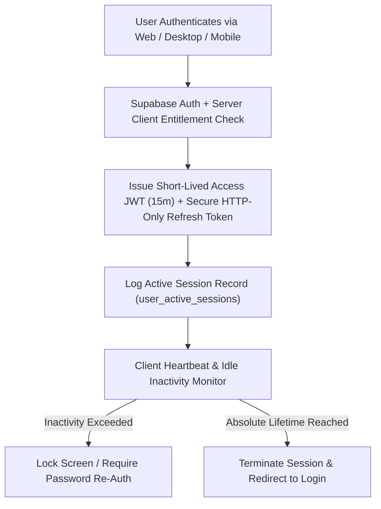
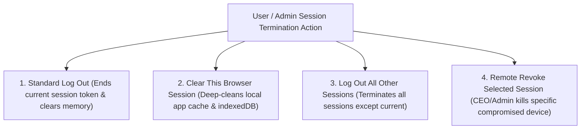

# ORNEXA — SESSION MANAGEMENT & SECURITY MASTER
**Authoritative Architectural Specification for User Sessions, Configurable Inactivity Timeouts, Token Refresh, and Remote Session Revocation**
*Version: 3.2.0 (Approved Source of Truth)*
*Last Updated: August 2026*

---

## 1. Enterprise Session Architecture

### 1.1 The Core Operating Principle
> **"SESSIONS ARE CRYPTOGRAPHICALLY SECURE, ACCURATELY TRACKED BY CLIENT SURFACE, AND GOVERNED BY ROLE-AWARE TIMEOUT POLICIES."**
>
> In high-stakes jewellery manufacturing and retail showrooms where shared workshop terminals and executive mobile phones operate simultaneously, Ornexa provides fine-grained, secure session management.



---

## 2. Configurable Timeout Hierarchy

Timeouts are not one-size-fits-all. They resolve through a 3-tier precedence hierarchy within safe platform boundaries:

```
1. Platform Safety Constraints (Min 5 mins, Max 30 days)
         │
         ▼
2. Tenant Firm Policy (e.g. Default 60 mins Inactivity)
         │
         ▼
3. Role-Scoped Overrides (e.g. Workshop Terminal 15 mins vs CEO Mobile 7 days)
```

| Operating Surface / Persona | Recommended Idle Timeout | Absolute Session Lifetime | Re-Authentication Requirement |
|---|---|---|---|
| **Workshop Floor / Shared Counter** | **15 Minutes** | 12 Hours | Requires Quick PIN / Password to unlock |
| **Accountant / Office Workstation** | **60 Minutes** | 24 Hours | Full Password Re-Authentication |
| **CEO / Executive Mobile App** | **7 Days (Biometric)** | 30 Days | Biometric FaceID / Fingerprint Refresh |
| **External Customer / Karigar Portal**| **30 Minutes** | 7 Days | Standard Password / OTP Login |

### 1.2 Portal Tenant Isolation (Non-Negotiable)

External portal sessions derive tenant and party scope exclusively from `portal_identities` and `portal_party_links` via SECURITY DEFINER RPCs. Direct URL or ID tampering must fail safely. No permissive `USING (true)` policies on portal-scoped data.

---

## 3. Session Lifecycle & Token Management

1. **Short-Lived Access Tokens:** Standard JWT access tokens expire after **15 minutes**.
2. **Silent Refresh Rotation:** The client runtime automatically requests a new access token using a rotating refresh token before expiration.
3. **Password Change Revocation:** Updating an account password automatically invalidates all existing refresh tokens and terminates active sessions across all devices except the current session.
4. **Suspicious Activity Revocation:** Detecting concurrent logins from geographically incompatible IP addresses flags an alert in Tenant 360 and prompts a security challenge.

---

## 4. Comprehensive Session Actions & "Clear This Browser Session"

Ornexa provides four distinct session termination actions:



### 4.1 "Clear This Browser Session" Protocol
When a user clicks **"Clear This Browser Session"** (e.g. after using a shared computer):
1. **Invalidate Active Token:** Calls Supabase `auth.signOut({ scope: 'local' })` to revoke the current client session.
2. **Clear Sensitive Browser State:** Purges transient UI/session memory and any non-authoritative browser cache entries that are not required for the live tenant session.
3. **Preserve External Data:** Safely targets only Ornexa-owned session state—**never wipes unrelated browser data belonging to other websites**.
4. **Clean Redirect:** Redirects to `/login` with an empty runtime footprint.

---

## 5. Session Governance Database Schema & UI Console

```sql
CREATE TABLE public.user_active_sessions (
    id UUID PRIMARY KEY DEFAULT gen_random_uuid(),
    user_id UUID NOT NULL REFERENCES auth.users(id) ON DELETE CASCADE,
    tenant_id UUID NOT NULL REFERENCES public.tenants(id) ON DELETE CASCADE,
    client_type TEXT NOT NULL, -- 'WEB', 'DESKTOP', 'MOBILE'
    device_model TEXT, -- 'MacBook Pro M3', 'iPhone 15 Pro', 'Windows 11 Workstation'
    browser_or_app TEXT, -- 'Chrome 128.0', 'Ornexa Desktop v3.2.0', 'iOS App v3.2.0'
    ip_address INET,
    approximate_location TEXT, -- 'Kolkata, WB, India'
    session_token_hash TEXT NOT NULL,
    created_at TIMESTAMPTZ NOT NULL DEFAULT clock_timestamp(),
    last_active_at TIMESTAMPTZ NOT NULL DEFAULT clock_timestamp(),
    expires_at TIMESTAMPTZ NOT NULL,
    is_revoked BOOLEAN NOT NULL DEFAULT false,
    revoked_at TIMESTAMPTZ,
    revoked_by UUID REFERENCES auth.users(id)
);
```

### 5.1 User Security Console (`/control/security/sessions`)
Internal users and administrators view and manage live sessions:
- **Active Device Cards:** Shows client type, approximate location, last active timestamp, and "This Device" badge.
- **One-Click Revoke:** Allows immediate termination of individual unrecognized devices.
- **Audit Logging:** Every revocation event is immutably logged in `system_audit_logs`.
