# ORNEXA — SETTINGS & SYSTEM CONFIGURATION MASTER
**Authoritative Architectural Specification for System Settings, Infrastructure Administration, Branch Management, User Access, and Cross-System Search**
*Version: 4.0.0 (Approved Source of Truth)*
*Last Updated: August 2026*

---

## 1. System Settings Philosophy

### 1.1 The Core Operating Principle
> **"SETTINGS CONFIGURES THE SYSTEM INFRASTRUCTURE; CUSTOMIZATION ADAPTS THE JEWELLERY BUSINESS."**
>
> Following our major architectural reorganization:
> - **Business Adaptation** (Terminology, Custom Dropdowns, Forms & Fields, Making Charge Rules, Manufacturing Workflows, Document Templates, Print Profiles, and Portal Layouts) has been moved to the top-level **Customization Workspace** (`/control/customization`).
> - **System Settings (`/control/settings`)** is now streamlined, concise, and focused strictly on infrastructure, security, users, branches, communication, and integrations.

```mermaid
graph TD
    UnifiedDB["PostgreSQL Configuration Tables (tenant_configurations)"]
    
    SettingsHub["System Settings Hub (/control/settings)"]
    SettingsHub --> Cat1["1. Firm & Legal Profile"]
    SettingsHub --> Cat2["2. Branches (Rebuilt Modern UI)"]
    SettingsHub --> Cat3["3. Users & RBAC Permissions"]
    SettingsHub --> Cat4["4. Security & Inactivity Timeouts"]
    SettingsHub --> Cat5["5. Communication & Email"]
    SettingsHub --> Cat6["6. WhatsApp Meta Partner"]
    SettingsHub --> Cat7["7. Hardware & Integrations (Scales, Tally)"]
    SettingsHub --> Cat8["8. Backup & Recovery (.ornexa.enc)"]
    SettingsHub --> Cat9["9. Device & Active Sessions"]
    SettingsHub --> Cat10["10. Commercial License & Add-Ons"]
    
    SettingsHub <--> UnifiedDB
```



---

## 2. The 10 System Settings Categories

```
┌─────────────────────────────────────────────────────────────────────────────┐
│                          SYSTEM SETTINGS CATEGORIES                         │
├───────────────────────┬─────────────────────────────────────────────────────┤
│ 1. Firm Profile       │ Legal name, GSTIN, registered address, firm logo    │
│ 2. Branches           │ Physical workshop/showroom locations, state GSTINs  │
│ 3. Users & Access     │ Staff user invitations, RBAC roles, branch scoping  │
│ 4. Security           │ Inactivity timeouts, 2FA, password change policies  │
│ 5. Communication      │ SMTP / Resend credentials, automated delivery rules │
│ 6. WhatsApp           │ Meta WABA partner credentials, template status sync │
│ 7. Integrations       │ Digital weighing scale serial ports, Tally export   │
│ 8. Backup & Data      │ Encrypted archive download (.ornexa.enc), restore   │
│ 9. Device & Sessions  │ Active device sessions, remote revocation console   │
│ 10. Licensing & Plan  │ Current plan tier (Basic–Max), active add-ons, AMC  │
└───────────────────────┴─────────────────────────────────────────────────────┘
```

---

## 3. Branches UI Architecture (Modern Low-Radius Design)

The Branch Management console (`/control/settings/branches`) is completely rebuilt according to Ornexa's professional ERP design system:
- **Clean Table / Register Layout:** Displays Branch Code, Display Name, City/State, GSTIN, Default Vault, Manager, and Active status in dense `32px` rows.
- **Compact Edit Drawer:** Slide-in drawer with structured field groupings (Identity, Tax, Hardware & Printers, Manager Assignment) with `2px–4px` subtle radius containers.
- **Zero AI-Slop:** Eliminates huge bubble-shaped cards, floating gradient pills, or massive whitespace.

---

## 4. Cross-System Global Search (`Ctrl/Cmd+/`)

The global search dispatcher searches across both **Settings** and **Customization**:
- Query: `"session timeout"` $\to$ Jumps to **Settings → Security**
- Query: `"branch manager"` $\to$ Jumps to **Settings → Branches**
- Query: `"invoice terms"` $\to$ Jumps to **Customization → Documents**
- Query: `"worker loss rules"` $\to$ Jumps to **Customization → Calculations**
- Query: `"karigar stage"` $\to$ Jumps to **Customization → Workflows**
