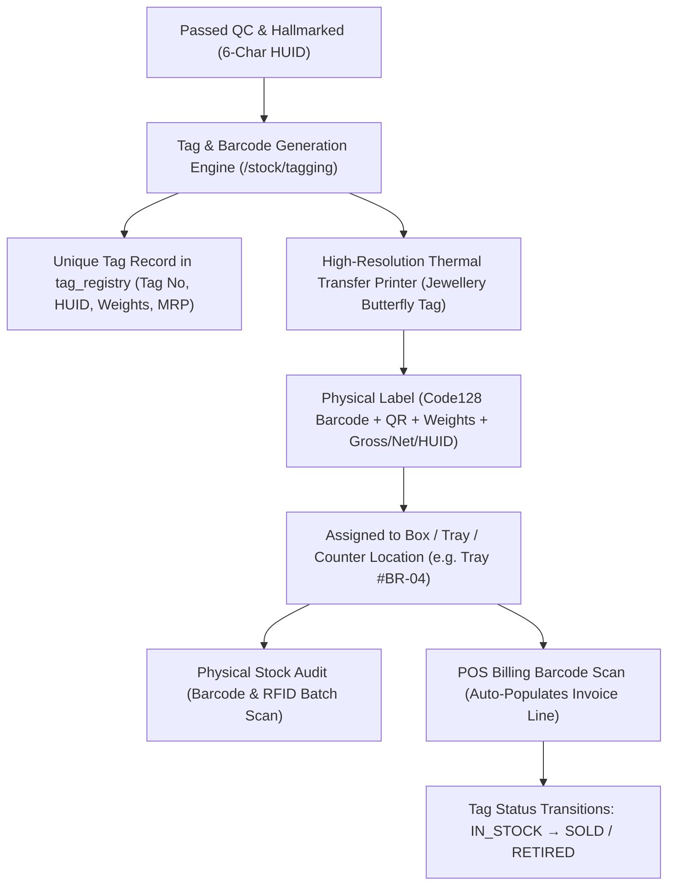
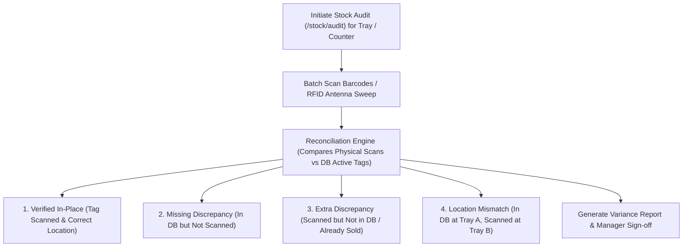

# ORNEXA — TAGGING, BARCODE, HUID & RFID TRACEABILITY MASTER
**Authoritative Architectural Specification for Unique Item Identification, Tag Lifecycles, Physical Stock Audits, and Hardware Integrations**
*Version: 3.1.0 (Approved Source of Truth)*
*Last Updated: August 2026*

---

## 1. Unique Item Traceability Architecture

### 1.1 The Core Operating Principle
> **"EVERY FINISHED JEWELLERY PIECE IS AN INDEPENDENTLY TRACKED ASSET WITH A UNIQUE TAG NUMBER, 1D/2D BARCODE, BIS HALLMARK (HUID), AND REAL-TIME PHYSICAL LOCATION."**
>
> In high-value retail and wholesale jewellery operations, loose bulk tracking is inadequate. Ornexa binds each finished ornament to an immutable **Tag Record** from creation in the workshop until customer delivery.

---

## 2. Comprehensive Tag Schema & Attributes

Each tag record in `tag_registry` encapsulates:
- `tag_number`: Unique alphanumeric tag identifier (e.g. `TG-2026-0842`).
- `barcode_data`: Standard **Code 128** or **DataMatrix** encoded string.
- `huid_code`: Official 6-character alphanumeric BIS Hallmarking Unique Identification code (e.g. `AB1234`).
- `item_master_id`: Linked jewellery product definition.
- `item_photo_url`: High-resolution photograph of the actual physical piece.
- `purity_stamp`: Karat and touch (e.g. `22K (916)`).
- `gross_weight_grams`: Total scale mass including metal, stones, and findings.
- `tag_tare_deduction`: Plastic sticker and string tare weight (e.g. `0.020g`).
- `less_weight_grams`: Wax, thread, enamel, or non-precious stone weight.
- `net_weight_grams`: Pure precious metal weight ($\text{Gross} - \text{Tare} - \text{Less} - \text{Stones}$).
- `diamond_carats` & `diamond_pieces`: Studded diamond breakdown.
- `stone_weight_grams` & `stone_pieces`: Colored gemstone breakdown.
- `making_charge_amount`: Pre-calculated retail making charge or per-gram tariff.
- `mrp_selling_price`: Dynamic or fixed retail price.
- `box_tray_id`: Current physical tray, showcase counter, or safe location.
- `status`: `IN_STOCK`, `RESERVED`, `ON_MEMO_APPROVAL`, `SOLD`, `MELTED_REWORK`, `RETURNED_TO_KARIGAR`.

---

## 3. Physical Stock Audit & RFID Discrepancy Engine

Ornexa provides an automated reconciliation console for daily and weekly showroom stock audits:

### 3.1 Discrepancy Actions
- **Location Auto-Correct:** One-click re-assignment of misplaced items to the scanned tray.
- **Security Alert:** Instant push notification to CEO for unexplained missing tags.
- **Audit History:** Preserves full log of audit date, scanned count, missing count, and auditing staff user.

---

## 4. Hardware Integration Standards

1. **Precision Digital Scales (RS232 / Web Serial / Bluetooth):** Streams real-time gross weight directly into tag generation forms, automatically deducting configured tag tare weights (`tag_tare_deduction`).
2. **Thermal Transfer Tag Printers (TSPL / ZPL / ESC-POS):** Direct output to industry-standard jewellery label printers (e.g. Citizen, TSC, Zebra) for micro butterfly tags without Windows print driver clipping.
3. **High-Speed Scanners & RFID Antennas:** Keyboard-wedge barcode scanners and UHF RFID readers operating at 865–868 MHz for rapid whole-tray stock auditing in under 3 seconds.
