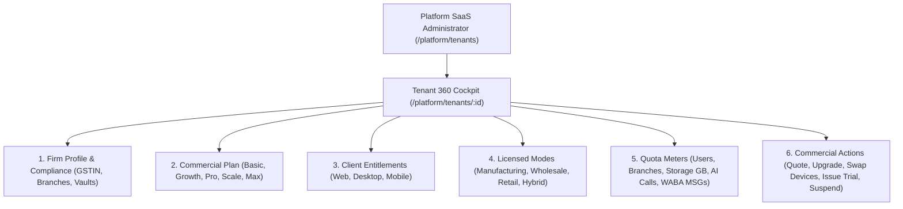

# ORNEXA — PLATFORM OWNER TENANT 360 MASTER
**Authoritative Specification for the SaaS Operator Tenant 360 Cockpit, Commercial Lifecycle Management, and Entitlement Administration**
*Version: 3.2.0 (Approved Source of Truth)*
*Last Updated: August 2026*

---

## 1. Platform Operator Tenant 360 Philosophy

### 1.1 The Core Operating Principle
> **"TENANT 360 IS THE AUTHORITATIVE COMMERCIAL AND TECHNICAL COCKPIT FOR EVERY ORNEXA SUBSCRIPTION."**
>
> Located at `/platform/tenants/:id`, Tenant 360 enables Platform Operators (`saas_admin` role) to monitor, quote, provision, modify, and audit all commercial parameters, device entitlements, and operational quotas for a tenant firm.



---

## 2. Comprehensive Tenant 360 UI Architecture

```
┌─────────────────────────────────────────────────────────────────────────────┐
│ TENANT 360: MAA TARA JEWELLERS PVT LTD (ID: 7f8a9b2c)                       │
├─────────────────────────────────────────────────────────────────────────────┤
│ Primary Commercial Plan:  ORNEXA PROFESSIONAL (v2.1)                        │
│ Primary Business Product: ORNEXA MANUFACTURING                              │
│ Subscription Status:      ACTIVE (Renews: 15-Mar-2027)                      │
│                                                                             │
│ 📱 CLIENT SURFACE ENTITLEMENTS (2 of 3 Selected):                           │
│  [✓] Web Browser Client       ACTIVE (client.web)                           │
│  [✓] Desktop Application      ACTIVE (client.desktop)                       │
│  [ ] Mobile App (iOS/Android) NOT LICENSED                                  │
│                                                                             │
│ 🏢 LICENSED BUSINESS CAPABILITIES:                                          │
│  [✓] Manufacturing Workshop Engine        ACTIVE (business.manufacturing)   │
│  [✓] Wholesale B2B Distribution Add-On    ACTIVE (business.wholesale)       │
│  [ ] Retail Showroom Counter POS          NOT LICENSED                      │
│                                                                             │
│ 📊 RESOURCE USAGE & QUOTAS:                                                 │
│  • Branches:   1 Base + 1 Add-On (2 Active / 2 Licensed)                    │
│  • Users:      14 Active / 20 Licensed Seat Limit                           │
│  • Storage:    18.4 GB Used / 50.0 GB Quota (36.8%)                         │
│  • WhatsApp:   4,120 / 10,000 Monthly Utility Messages                      │
│  • AI Calls:   1,840 Context Queries / Metered Cloud LLM                    │
│                                                                             │
│ ⚡ COMMERCIAL OPERATIONS CONSOLE:                                           │
│  [ Create Sales Quotation ]  [ Upgrade Plan Tier ]  [ Swap Client Surface ] │
│  [ Add Branch License ]      [ Issue 14-Day Trial ] [ Suspend Subscription ]│
└─────────────────────────────────────────────────────────────────────────────┘
```

---

## 3. Commercial Operations & Audit Trails

Every commercial modification executed in Tenant 360 creates an immutable record in `tenant_entitlement_audit_log`:
- **Audit Attributes:** `timestamp`, `operator_id`, `tenant_id`, `action_type` (`PLAN_UPGRADE`, `DEVICE_SWAP`, `BRANCH_ADDED`, `TRIAL_GRANTED`), `old_state`, `new_state`, `reason`, `authorized_by`.
- **Zero-Downtime Application:** Changes propagate instantly to active client sessions via Supabase Realtime without restarting services or disconnecting users.
