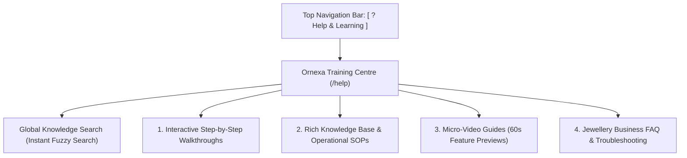

# ORNEXA — TRAINING CENTRE & LEARNING HUB MASTER
**Authoritative Architectural Specification for the Self-Service Help & Learning Hub, Interactive Courses, Written Knowledge Base, and FAQ Engine**
*Version: 3.3.0 (Approved Source of Truth)*
*Last Updated: August 2026*

---

## 1. Central Help & Learning Hub Philosophy

### 1.1 The Core Operating Principle
> **"LEARNING RESOURCES ARE FIRST-CLASS CITIZENS IN ORNEXA, FREELY ACCESSIBLE VIA THE TOP NAVIGATION BAR (`? HELP & LEARNING`), NOT BURIED INSIDE TECHNICAL SETTINGS MENUS."**
>
> The Training Centre (`/help`) provides comprehensive self-paced education tailored to jewellery factory owners, workshop supervisors, counter staff, and accountants.



---

## 2. Topic Catalog & Course Structure

```
┌─────────────────────────────────────────────────────────────────────────────┐
│                      ORNEXA TRAINING CENTRE CURRICULUM                      │
├───────────────────────┬─────────────────────────────────────────────────────┤
│ 1. Getting Started    │ First-day workspace orientation, navigation, login  │
│ 2. Manufacturing Hub  │ Job cards, Karigar issue/receive, melting, scrap    │
│ 3. Gold & Bullion     │ Daily Bhav rate cards, touch fineness, fine gold    │
│ 4. Party 360          │ Customers, Karigars, Dealers, Suppliers, Opening Bal│
│ 5. Inventory & Tags   │ Barcode tags, BIS HUID hallmarking, tray audits     │
│ 6. Dual Accounting    │ Cash & fine metal double-entry, GST, Tally Prime XML│
│ 7. Executive Reports  │ Where Is My Gold?, Ageing, P&L, GST GSTR-1/3B audit │
│ 8. Document & Print   │ Invoices, vouchers, thermal POS, print profile setup│
│ 9. External Portals   │ Customer CAD approvals, Karigar return, Supplier PO │
│ 10. AI Assistant      │ Natural language queries, voice flow, confirmations │
│ 11. Security & Backup │ Inactivity timeout, encrypted .ornexa.enc backups   │
│ 12. Keyboard Mastery  │ Desktop keyboard hotkeys, rapid counter navigation  │
└───────────────────────┴─────────────────────────────────────────────────────┘
```

---

## 3. Training Progress & Replay Infrastructure

```sql
CREATE TABLE public.user_tutorial_progress (
    id UUID PRIMARY KEY DEFAULT gen_random_uuid(),
    user_id UUID NOT NULL REFERENCES auth.users(id) ON DELETE CASCADE,
    tenant_id UUID NOT NULL REFERENCES public.tenants(id) ON DELETE CASCADE,
    module_code TEXT NOT NULL, -- 'GETTING_STARTED', 'MANUFACTURING_MASTER', 'ACCOUNTING'
    progress_percentage INTEGER NOT NULL DEFAULT 0, -- 0 to 100
    current_step_index INTEGER NOT NULL DEFAULT 0,
    is_completed BOOLEAN NOT NULL DEFAULT false,
    completed_at TIMESTAMPTZ,
    last_updated_at TIMESTAMPTZ NOT NULL DEFAULT clock_timestamp(),
    CONSTRAINT user_module_unique UNIQUE (user_id, module_code)
);
```

- **Non-Coercive Policy:** Training completion is an empowering tool, never a blocking gate preventing daily business operations unless explicitly enforced by custom tenant policy.
