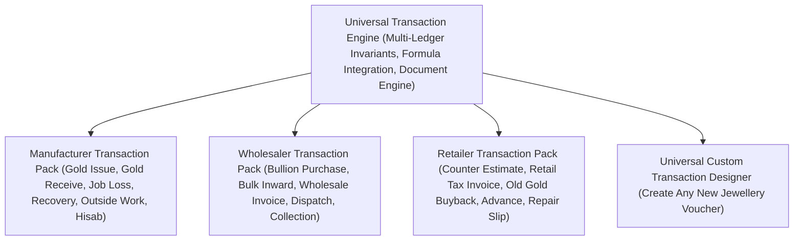

# ORNEXA — TRANSACTION PRESET MASTER SPECIFICATION
**Authoritative Architectural Specification for Domain Transaction Presets: Manufacturer, Wholesaler, Retailer, and Universal Customization**
*Version: 3.1.0 (Approved Source of Truth)*
*Last Updated: August 2026*

---

## 1. Transaction Preset Philosophy

### 1.1 The Core Operating Principle
> **"EACH BUSINESS MODE EXPOSES RELEVANT DEFAULT TRANSACTION TYPES OUT OF THE BOX, ALL RUNNING ON THE UNIVERSAL TRANSACTION ENGINE."**
>
> Rather than overwhelming a retail store with 40 complex factory melting vouchers, or forcing a manufacturer through retail cash-drawer receipts, Ornexa provisions tailored transaction starter packs.

---

## 2. Business Mode Transaction Presets

| Business Mode Preset | Standard Default Transaction Types | Core Target Ledger Postings | Output Documents |
|---|---|---|---|
| **Jewellery Manufacturer** | 1. `Karigar Gold Issue` 2. `Karigar Receive & Return` 3. `Melting & Assay Slip` 4. `Outside Work Challan (Mina/Polish)` 5. `Karigar Hisab Settlement` 6. `Tax Invoice (B2B)` | `Dr Karigar Metal Ledger` `Cr Karigar Metal Ledger` `Dr/Cr Melting Loss` `Dr Outside Custody` `Cr Karigar Labour Due` `Dr Customer / Cr Sales` | Issue Voucher Receive Slip Assay Certificate Outside Challan Hisab Statement Tax Invoice A4 |
| **Jewellery Wholesaler** | 1. `Bullion / Stock Purchase` 2. `Bulk Inward / Tag Batch` 3. `Dealer Order Booking` 4. `Dispatch Challan` 5. `Wholesale Tax Invoice` 6. `B2B Collection Receipt` | `Dr Purchase / Cr Vendor` `Dr Finished Inventory` `Order Reservation` `Dr Transit Stock` `Dr Dealer / Cr Sales` `Dr Bank / Cr Dealer` | Purchase Note Tag Batch Sheet Order Confirmation Dispatch Challan GST Invoice Payment Receipt |
| **Retail Jeweller** | 1. `Counter Estimate Slip` 2. `Retail Sales Invoice` 3. `Old Gold Exchange Buyback` 4. `Customer Advance Booking` 5. `Jewellery Repair Intake` 6. `Cash / UPI Receipt` | `Non-Posting` `Dr Cash/Bank / Cr Sales` `Dr Old Gold / Cr Customer` `Dr Cash / Cr Customer Deposit` `Dr Repair WIP` `Dr Cash / Cr Customer` | Estimate Proforma Retail Bill (A4/80mm) Old Gold Voucher Advance Receipt Repair Job Slip Receipt Voucher |

---

## 3. Custom Transaction Designer Integration

If a business requires a non-standard trade transaction:
1. Open **Settings → Transaction Designer (`/control/transactions`)**.
2. Define voucher name, code, prefix, and numbering sequence.
3. Configure line-item fields (Gross Wt, Touch %, Fine Gold, Making Charges, Taxes).
4. Declare ledger effects (Money, Metal, Stock, Party, WIP).
5. Bind to a document template and print profile.
6. Test in preview simulation and activate instantly.
