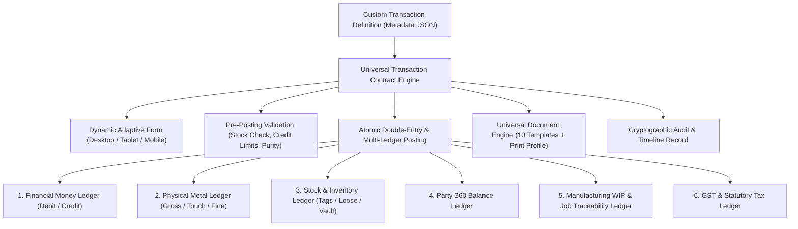

# ORNEXA — UNIVERSAL TRANSACTION & VOUCHER ENGINE MASTER
**Authoritative Architectural Specification for Declarative Transaction Definitions, Multi-Ledger Invariants, and Custom Business Workflows**
*Version: 3.1.0 (Approved Source of Truth)*
*Last Updated: August 2026*

---

## 1. Universal Transaction Engine Philosophy

### 1.1 The Core Operating Principle
> **"WE CANNOT PREDICT EVERY FUTURE JEWELLERY TRANSACTION. THEREFORE, AUTHORISED TENANTS CAN INTRODUCE LEGITIMATE NEW BUSINESS TRANSACTIONS THROUGH DECLARATIVE METADATA WITHOUT TOUCHING SOURCE CODE."**
>
> In jewellery manufacturing, regional trade practices yield unique vouchers: *Refinery Melting Loss Vouchers*, *KDM Solder Inward*, *Mina Book Subcontract Slips*, *Exhibition Consignment Notes*, *Bullion Swap Chits*. Ornexa unifies all transactions through a single **Universal Transaction Engine**.



---

## 2. Universal Transaction Definition Schema

An administrator creates a new transaction type in **Settings → Transaction Types (`/control/transactions`)**:

| Component | Declarative Capabilities | Safety & Validation Guardrails |
|---|---|---|
| **Header Definition** | Name, Code, Prefix, Category (Sales, Purchase, Manufacturing, Vault, Settlement) | Unique tenant code, financial year resets |
| **Party Requirements** | Allowed party types (Customer, Supplier, Karigar, Refinery, Hallmark), required/optional | Role permission verification |
| **Custom Header Fields**| Custom attributes (Text, Number, Date, Dropdown, Formula, Scan) | Strict type validation |
| **Line-Item Grid** | Metal rows, Stone/Diamond rows, Charge rows, Payment rows | Required column definitions |
| **Material Movement** | Direction (`INWARD`, `OUTWARD`, `TRANSFER`, `NONE`), Target Vault/Bench | Live stock availability check |
| **Accounting Posting** | Debit Account mapping, Credit Account mapping, Tax rules | Strict balancing ($\sum \text{Debit} = \sum \text{Credit}$) |
| **Approval Rules** | Auto-post, Single Approval, Multi-Tier Approval (> ₹ Threshold or > Gram Threshold) | Approver role grants |
| **Document Binding** | Selected Document Template, Print Profile, Numbering series | Bound to Document Engine |

---

## 3. Strict Multi-Ledger Invariants (Zero-Leak Principle)

```
╔══════════════════════════════════════════════════════════════════════════════╗
║                   CRITICAL MULTI-LEDGER INTEGRITY INVARIANT                  ║
╠══════════════════════════════════════════════════════════════════════════════╣
║ Every transaction MUST explicitly declare its effects across all 6 ledgers:  ║
║  1. Money Ledger: Double-entry monetary debit & credit.                      ║
║  2. Metal Ledger: Physical gross weight, touch purity %, and fine gold.      ║
║  3. Stock Ledger: Tagged item, loose gram, or raw bar custody state.         ║
║  4. Party Ledger: Party financial and physical metal balances.               ║
║  5. Manufacturing Ledger: Job card WIP, scrap recovery, and stage progress.  ║
║  6. Tax Ledger: GST taxable values, CGST, SGST, IGST, and TCS/TDS schedules. ║
║                                                                              ║
║ IF A TRANSACTION MOVES GOLD, IT CAN NEVER EXIST OUTSIDE GOLD ACCOUNTABILITY.  ║
╚══════════════════════════════════════════════════════════════════════════════╝
```

---

## 4. Built-In Standard Transaction Catalog

Ornexa ships with standardized, production-tested transaction definitions:

1. **Commercial Sales:** Retail Tax Invoice, B2B Tax Invoice, Sales Estimate, Sales Return / Credit Note.
2. **Purchases & Inward:** Old Gold Purchase, Bullion Purchase Invoice, Gemstone Lot Inward, Consignment Receive.
3. **Workshop & Manufacturing:** Karigar Metal Issue, Karigar Return & Finished Receive, Melting Issue/Receive, Casting Slips, Scrap Settlement.
4. **Subcontractor & Specialized:** Outside Work Challan (Mina, Setting, Polish), Outside Return, Refinery Dispatch, Hallmark (HUID) Challan.
5. **Treasury & Vault:** Inter-Vault Transfer, Daily Cash Receipt, Bank Payment Voucher, Journal Voucher, Contra Transfer.
6. **Custom User-Defined:** E.g. *Exhibition Consignment Outward*, *Gold Bullion Loan Swap*, *Customer Scrap Exchange*.
