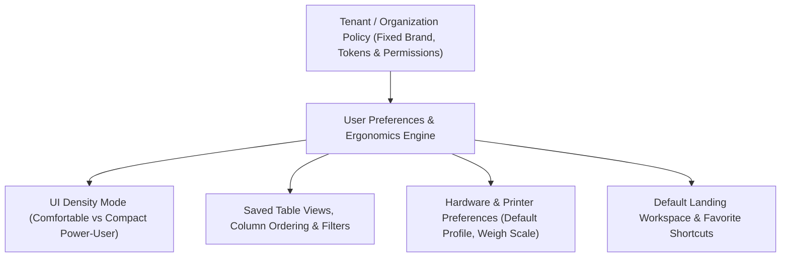
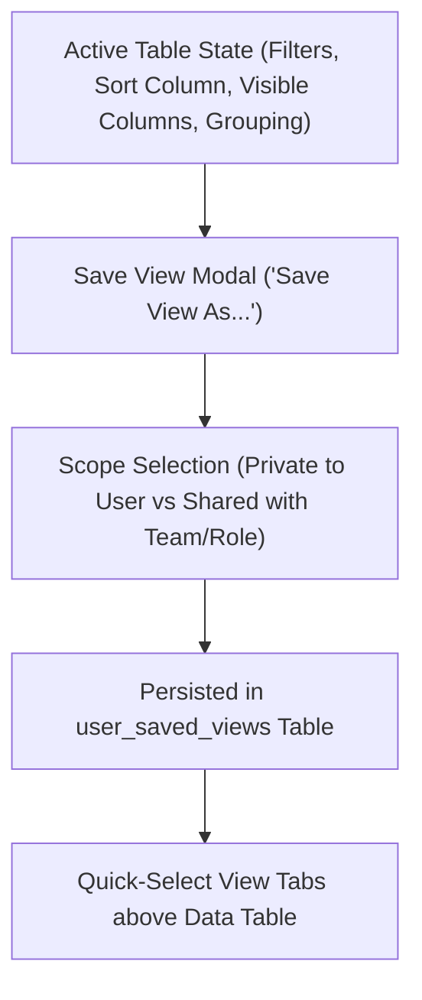

# ORNEXA — USER PREFERENCES & SAVED VIEWS MASTER
**Authoritative Architectural Specification for Personal Ergonomics, Table Layout Customization, and Saved Filter Views**
*Version: 3.1.0 (Approved Source of Truth)*
*Last Updated: August 2026*

---

## 1. Personal Ergonomics vs Tenant Configuration Boundary

### 1.1 The Core Operating Principle
> **"PERSONAL PREFERENCES EMPOWER INDIVIDUAL PRODUCTIVITY WITHOUT BREAKING TENANT-WIDE BRAND IDENTITY OR SECURITY POLICIES."**
>
> Users can freely configure ergonomic settings that enhance their personal workflow speed, while core brand guidelines, access permissions, and financial logic remain strictly governed by tenant policy.

---

## 2. Configurable User Preferences

Each authenticated user can customize their personal settings via **Profile & Preferences (`/control/preferences`)**:

1. **Active UI Language:** Select preferred operational language (English, Marathi, Hindi, etc.).
2. **Display Density Mode:**
   - *Comfortable:* Standard 44px row heights, generous touch padding (default for casual/tablet use).
   - *Compact (Power-User):* Dense 32px/28px row heights, tighter typography (optimized for high-volume desktop billing).
3. **Default Landing Workspace / Portal:** Choose default start screen upon login (e.g. direct to `/work/jobs` for manufacturing supervisors, or `/stock/vault` for vault custodians).
4. **Default Active Branch:** For users assigned to multiple branches, set default operating branch without manual switching on login.
5. **Default Printer & Print Profile:** Auto-route invoices and vouchers to the user's specific desk printer or thermal slip machine.
6. **Notification Channels & Alert Frequency:** Configure in-app audio chimes, desktop push alerts, and high-priority WhatsApp pings.
7. **Personal Keyboard Shortcut Overrides:** Customize individual key bindings within permitted tenant shortcut bounds.

---

## 3. Saved Table Views & Custom Filter Engine

Users can save complex table configurations, search queries, and column arrangements as **Saved Named Views** for instant one-click recall.

### 3.1 Practical Industry View Examples
- **"My Pending Karigar Jobs":** Filtered to active jobs assigned to the current user's department with deadline < 48 hours.
- **"Gold Outstanding > 7 Days":** Filtered to artisan custody accounts where unreturned metal has been out over one week.
- **"Ready Stock Under 5g":** Filtered to lightweight gold jewellery inventory available for counter sales.
- **"Diamond Rings Pending Hallmark":** Filtered to finished jewellery items awaiting HUID laser engraving.
- **"High-Value Unapproved Estimates":** Filtered to customer proforma quotations exceeding ₹5,00,000 awaiting manager approval.

---

## 4. Preference Synchronization & Performance

- **Cloud Persistence:** User preferences and saved views are stored in the `user_preferences` and `user_saved_views` Supabase tables with strict user-level RLS.
- **Instant Client Hydration:** Cached in browser session memory for the active runtime only, ensuring zero layout shift or theme flicker on page load without creating a local-authoritative store.
- **Cross-Device Fluidity:** Ergonomic preferences sync automatically when logging into a new desktop or workshop tablet through the approved Supabase-backed tenant flow.
