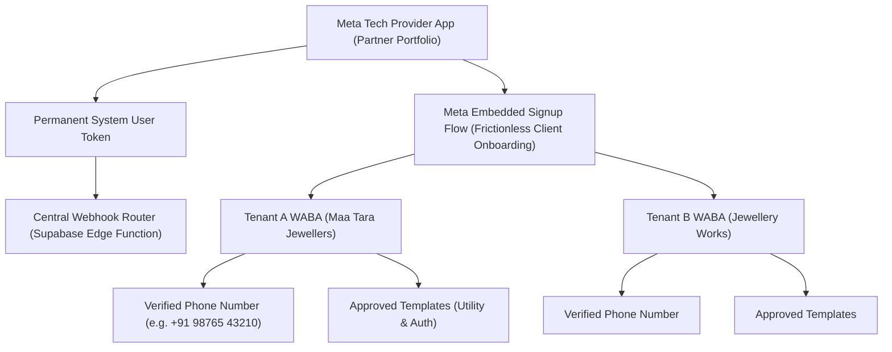

# ORNEXA — WHATSAPP & META PARTNER MASTER SPECIFICATION
**Authoritative Specification for WhatsApp Cloud API & Partner Architecture**
*Version: 3.0.0 (Approved Source of Truth)*
*Last Updated: August 2026*

---

## 1. Meta Partner Architecture Overview

Ornexa integrates directly with the **Meta WhatsApp Business Cloud API** as an official Tech Partner. The system supports both centralized partner-managed message routing and decentralized client-owned WhatsApp Business Accounts (WABA).



---

## 2. Commercial Modes & WhatsApp Deployment Options

Ornexa provides four flexible operational modes to accommodate varying tenant preferences and compliance needs:

| Commercial Mode | Description | Billing & Payment Setup | Ideal For |
|---|---|---|---|
| **Mode A: WhatsApp OFF** | All WhatsApp features disabled. System uses Email and in-app notifications only. | ₹0 (No WhatsApp cost). | Firms with no WhatsApp requirements. |
| **Mode B: Managed Partner Service** | Tenant sends messages through Ornexa's managed Meta Partner credit line. | Per-message rate + monthly add-on fee billed via SaaS invoice. | Small/Medium jewellers wanting zero Meta setup hassle. |
| **Mode C: Client-Owned WABA (Embedded Signup)** | Tenant connects their own Meta Business Manager via Embedded Signup. | Tenant pays Meta directly for conversation costs. | High-volume enterprises with existing Meta Business assets. |
| **Mode D: Custom Connector** | Custom API connector for specialized third-party aggregators. | Custom tenant-managed API gateway. | Specific bespoke integrations. |

---

## 3. Granular Message Automation Feature Switches

Tenants can independently enable or disable automated WhatsApp notifications for specific business events to control message volume and cost:

```
┌─────────────────────────────────────────────────────────────────────────────┐
│                   WHATSAPP AUTOMATION FEATURE SWITCHES                      │
├─────────────────────────────────────┬───────────────────┬───────────────────┤
│ Notification Event                  │ Default State     │ Template Category │
├─────────────────────────────────────┼───────────────────┼───────────────────┤
│ 🧾 Tax Invoice Ready (with PDF link) │ [x] ENABLED       │ Utility           │
│ 💳 Payment Receipt Confirmation     │ [x] ENABLED       │ Utility           │
│ ⏰ Payment / Due Date Reminder       │ [ ] OPTIONAL      │ Utility           │
│ 📦 Order Confirmed & Progress Update │ [x] ENABLED       │ Utility           │
│ 🎨 CAD Design Approval Request       │ [x] ENABLED       │ Utility           │
│ 💎 Curated Catalogue Collection Share│ [x] ENABLED       │ Marketing         │
│ 🎉 Ready for Collection Notice      │ [x] ENABLED       │ Utility           │
│ 🔨 Karigar Job Assignment Reminder   │ [ ] OPTIONAL      │ Utility           │
│ 🚚 Supplier Purchase Order Memo     │ [ ] OPTIONAL      │ Utility           │
│ 🏷️ Hallmark Outward & Return Memo    │ [ ] OPTIONAL      │ Utility           │
└─────────────────────────────────────┴───────────────────┴───────────────────┘
```

---

## 4. Meta Embedded Signup Implementation Standard

1. **Frontend Integration:** Uses the official Meta JavaScript SDK (`FB.login`) with the `whatsapp_business_management` and `whatsapp_business_messaging` scopes.
2. **Backend Token Exchange:** An Edge Function exchanges the short-lived OAuth code for a permanent granular system token and persists:
   - `waba_id`: The client's unique WhatsApp Business Account ID.
   - `phone_number_id`: The verified sender phone number ID.
   - `business_verification_status`: Status of the business in Meta Business Manager.
3. **Template Synchronization:** Automatically registers and syncs pre-approved standard utility templates into the tenant's WABA upon successful onboarding.

---

## 5. Webhook Handling & Message Status Tracking

- **Inbound Webhook Endpoint:** Supabase Edge Function `/functions/v1/whatsapp-webhook` validates the HMAC SHA-256 signature using the configured Meta App Secret.
- **Status Events Processed:** `sent`, `delivered`, `read`, `failed`.
- **Failure Handling:** If delivery fails (e.g. *User not on WhatsApp* or *Template mismatch*), the system logs the exact Meta error code, flags the message in the communication hub, and falls back to SMS/Email where configured.
