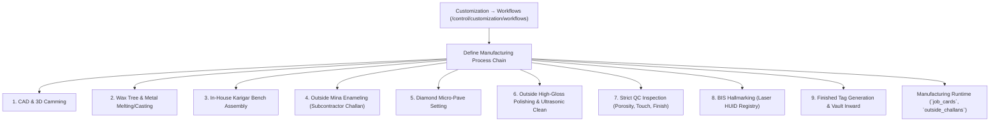

# ORNEXA — WORKFLOW & PROCESS CUSTOMIZATION MASTER
**Authoritative Architectural Specification for Manufacturing Stages, Subcontracted Outside Processes, Quality Gates, and Approval Chains**
*Version: 4.0.0 (Approved Source of Truth)*
*Last Updated: August 2026*

---

## 1. Workflow Customization Philosophy

### 1.1 The Core Operating Principle
> **"WORKFLOW CONFIGURATION LIVES UNDER CUSTOMIZATION; WORKFLOW EXECUTION LIVES INSIDE MANUFACTURING."**
>
> Jewellery factories operate diverse production routes (e.g. *Direct Plain Casting vs Multi-Stage Filigree with Outside Mina and Micro-Setting*).
>
> The Workflow Designer at **Customization → Workflows** (`/control/customization/workflows`) allows administrators to define custom stage sequences, outside process chains, and mandatory quality gates.

---

## 2. Configurable Process Attributes

For each workflow stage, administrators configure:
- **Process Type:** `IN_HOUSE` (Bench karigar) vs `OUTSIDE_VENDOR` (Subcontracted Mina/Polish vendor).
- **Mandatory Weight Capture:** Gross Weight in, Gross Weight out, Scrap return, Dust recovery.
- **Allowed Stage Loss Threshold (%):** Maximum permitted metal loss before triggering supervisor review.
- **Quality Checkpoints:** Checkbox criteria required before stage graduation.
- **Document Output:** Subcontractor Outward Delivery Challan, Job Transfer Voucher.

---

## 3. Approval Workflows & Authority Matrix

- **CAD Customer Approval Gate:** Customer must sign off on 3D renders via Customer Portal before wax tree investment.
- **High-Value Metal Issue Authorization:** Issues exceeding $500\text{g}$ require Factory Manager PIN authorization.
- **Scrap Variance Exception Gate:** Melting recovery loss exceeding $0.15\%$ triggers executive audit hold.
