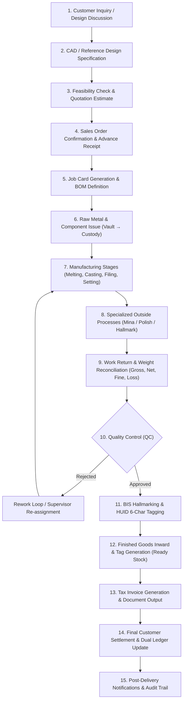
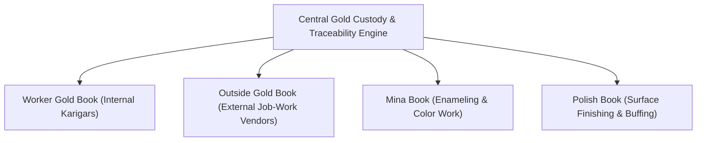
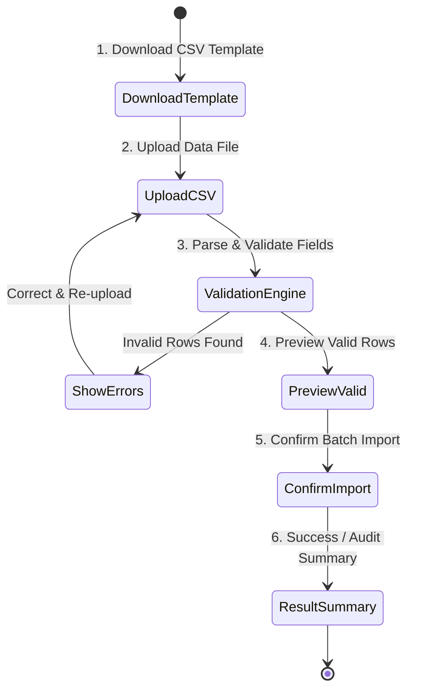

# ORNEXA — WORKFLOW MASTER SPECIFICATION
**Authoritative Manufacturing & Business Workflows**
*Version: 3.0.0 (Approved Source of Truth)*
*Last Updated: August 2026*

---

## 1. The Core Manufacturing-First Lifecycle

Ornexa is fundamentally a **B2B Jewellery Manufacturing ERP**, not a retail counter POS. All workflows follow the rigorous lifecycle below:

---

## 2. The Central Manufacturing Book

The **Manufacturing Book** (`/work/manufacturing-book`) is the master historical record connecting all lifecycle events for an article or order. It provides complete audit answers to:
> *"What happened to this jewellery job from raw gold issuance to final customer delivery?"*

### 2.1 Linked Event Records
Every row in the Manufacturing Book links:
- **Order & Job No:** Parent sales order and assigned batch.
- **Design & Image:** CAD thumbnail and technical drawing reference.
- **Material Issue History:** Timestamped fine gold, alloy, stones, and findings issued.
- **Worker / Department Custody:** Current and historical handlers.
- **Stage Progression:** Timestamps and notes for Casting, Filing, Setting, Polish, Mina, Hallmark.
- **Weight Dynamics:** Target weight vs actual gross, net, touch, and fine weight at each handoff.
- **Wastage & Loss:** Calculated allowable Ghat vs actual deviation.
- **QC Logs:** Pass/fail notes, rework reasons, and inspector identity.
- **Settlement & Cost:** Accrued labour charges, outside processor fees, and materials consumed.

---

## 3. Unified Gold Custody & Material Movement Books

Rather than maintaining disconnected accounting systems, Ornexa uses a **single underlying Material Movement Traceability Engine** with four specialized operational books:

### 3.1 Worker Gold Book (`/work/worker-gold-book`)
- **Purpose:** Tracks gold and material issued to internal bench karigars.
- **Key Operations:**
  - Material Issue (Gross mg, Purity %, Touch, Net Fine mg).
  - Material Return (Finished article, Scrap/Ghat, Filings, Dust).
  - Fine Gold Balance Reconciliation (`Issued Fine - Returned Fine - Allowed Loss`).
  - Labour charges computation & wage settlement vouchers.

### 3.2 Outside Gold Book (`/work/outside-gold-book`)
- **Purpose:** Tracks gold sent to third-party workshops under GST Section 143 (Job-Work Challans).
- **Compliance & Controls:**
  - Formal Delivery Challan generation with GSTIN and State Codes.
  - Aging alerts at 270 days and 300 days (mandatory return rule before 1-year tax penalty).
  - Reconciles outside contractor processing charges and allowable shrinkage.

### 3.3 Mina Book (`/work/mina-book`)
- **Purpose:** Manages the specialized enameling, Kundan, and Meena process lifecycle.
- **Complete Workflow:**
  1. Issue to Mina artisan with base weight and color specification.
  2. Enameling process execution.
  3. Return with enamel weight additions and scrap reclamation.
  4. Meena charge calculation (per gram, per piece, or fixed lot rate).
  5. Handover to next assembly or polishing stage.

### 3.4 Polish Book (`/work/polish-book`)
- **Purpose:** Manages the final surface finishing, ultrasonic cleaning, and buffing operations.
- **Complete Workflow:**
  1. Handover of assembled jewellery pieces to polishing department.
  2. High-precision pre-polish weighing (0.001g accuracy).
  3. Polishing process and dust recovery filtering.
  4. Post-polish weighing, allowable polish loss deduction, and fine metal recovery log.
  5. Routing to Quality Control (QC).

---

## 4. Ready Stock & Inventory Engine

### 4.1 Stock Master Requirements
- **Item Categorization:** Category → Subcategory → Design → Individual Piece / Tag.
- **Detailed Attributes:** Tag/Barcode ID, Gross Weight, Net Weight, Stone Weight, Wastage %, Making Charge, Hallmark HUID, Physical Tray/Box Location.
- **Multi-Image Support:** Up to 5 high-resolution product photos uploaded directly to secure Supabase/R2 storage with thumbnail auto-generation.

### 4.2 Standardized Bulk Import Workflow
All bulk data ingestion follows a strict multi-step validation pattern with contextual back navigation:

*Rule: Never silently import malformed rows. The user can always click `← Back to Ready Stock`.*

---

## 5. Gold Stock UI & Reconciliation

The **Gold Stock** screen (`/stock/gold-stock`) provides absolute clarity across all physical and ledger metal states:

| Metal Category | Description & Source |
|---|---|
| **Opening Gold** | Verified balance brought forward from previous financial period. |
| **Purchases / Inward** | Bullion purchases from approved dealers or bank delivery. |
| **Customer Old Gold** | Old gold received for exchange, melting, or credit. |
| **Fine Gold Bars (24K)** | Pure 99.9% / 99.5% bullion in the primary vault. |
| **Alloy & KDM** | Master alloys (Copper, Silver, Zinc) for karatage conversion. |
| **Issued WIP Gold** | Metal currently issued across active Job Cards. |
| **Worker Custody** | Metal currently held across internal bench karigars. |
| **Outside Job-Work** | Metal currently with external contractors (Section 143). |
| **Mina / Polish WIP** | Metal undergoing surface finishing or enameling. |
| **Recoverable Scrap / Dust**| Workshop floor sweeps, filings, and polishing recovery. |
| **Refinery Lots** | Metal sent to refinery for assaying and pure bar conversion. |
| **Available Vault Gold**| Unallocated metal ready for fresh job card issuance. |

---

## 6. Expense Management Module

The **Expenses** module (`/accounts/expenses`) is a fully functional operational system:
- **Add Expense:** Category, Beneficiary Party, Date, Gross Amount, Tax Rate (GST), Payment Method (Cash, Bank, UPI), Source Account, Branch ID, Voucher No.
- **Attachment Upload:** Receipts, bills, and tax invoices stored in secure R2 storage.
- **Multi-Level Approval:** Configurable threshold (e.g., expenses > ₹25,000 require Manager/Owner sign-off).
- **Accounting Posting:** Automatically generates ledger entries and updates cash/bank balances upon approval.
- **Custom Categories:** User-configurable expense categories without source-code changes.

---

## 7. Universal Back-Navigation Standard

Every nested sub-screen, configuration tab, import wizard, or detail view must render a prominent, unambiguous back button:
- **Pattern:** `<Button variant="ghost" onClick={() => navigate({ to: parentRoute })}> ← Back to [Parent Section] </Button>`
- **Coverage:** Ready Stock Import, Job Card Detail, Invoice Editor, Party 360, Document Print Preview, Settings Panels, CEO Reports, Karigar Portal Sub-views.
- **Rule:** Users must never be forced to reopen the main navigation sidebar to return from a child workflow.
