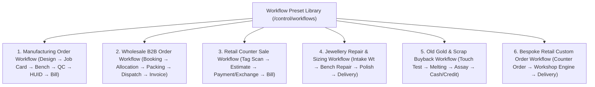

# ORNEXA — WORKFLOW PRESET & LIFECYCLE MASTER
**Authoritative Architectural Specification for Manufacturing, Wholesale, Retail, Repair, and Custom Order Workflow Presets**
*Version: 3.1.0 (Approved Source of Truth)*
*Last Updated: August 2026*

---

## 1. Reusable Workflow Template Philosophy

### 1.1 The Core Operating Principle
> **"WORKFLOWS DEFINE OPERATIONAL STAGES AND HANDOFFS; THEY NEVER BYPASS ACCOUNTING OR GOLD ACCOUNTABILITY INVARIANTS."**
>
> Ornexa provides battle-tested **Workflow Presets** tailored for Manufacturing, Wholesale, Retail, Repair, and Custom Bespoke jewellery. Tenants can customize stages, add approval gates, and rename milestones without modifying the core state engine.



---

## 2. Canonical Workflow Presets

### 2.1 Manufacturing Order Workflow (Manufacturer Preset Default)
```
[ Order / CAD Approval ] 
       │
       ▼
[ Job Card Generation ] ──▶ [ Raw Metal Issue (Pure Gold + Alloy) ]
       │
       ▼
[ Bench Fabrication (Melting, Forming, Filigree) ]
       │
       ▼
[ Outside Processing (Optional: Mina, Micro-Setting) ]
       │
       ▼
[ High-Gloss Polishing & Cleaning ]
       │
       ▼
[ Strict QC Inspection ] ──(Fail)──▶ [ Rework Loop ]
       │ (Pass)
       ▼
[ BIS Hallmarking & Laser HUID ] ──▶ [ Tag Generation & Stock Inward ] ──▶ [ Invoice & Settlement ]
```

### 2.2 Wholesale B2B Order Workflow (Wholesaler Preset Default)
```
[ Dealer Order Booking ] ──▶ [ Stock Allocation / Picking ] ──▶ [ Box Packing & Barcode Scan ]
       │
       ▼
[ Dispatch Challan & Courier Waybill ] ──▶ [ Wholesale Tax Invoice ] ──▶ [ Payment / Ledger Settlement ]
```

### 2.3 Retail Counter Sale & Old Gold Exchange Workflow (Retail Preset Default)
```
[ Customer Enquiry ] ──▶ [ Ready Tag Scan / Estimate ] ──▶ [ Optional Old Gold Appraisal / Deduction ]
       │
       ▼
[ POS Tax Invoice ] ──▶ [ Multi-Mode Payment (Cash/Card/UPI/Gold) ] ──▶ [ Delivery & WhatsApp Invoice ]
```

### 2.4 Retail Bespoke Custom Order (Unified Workflow)
> *Rule: A retail jeweller taking custom orders routes the requirement directly into the core Manufacturing Engine. No duplicated second engine is ever created.*
```
[ Retail Customer Design Request ] ──▶ [ Custom Order Booking & Advance Gold/Cash ]
       │
       ▼
[ Automatic Job Card in Manufacturing Engine ] ──▶ [ Workshop Production & QC ]
       │
       ▼
[ Finished Ornament Delivered to Retail Counter ] ──▶ [ Final Invoice & Customer Gold Settlement ]
```

---

## 3. Workflow Customization Controls & Safety Guardrails

Administrators can customize workflows via the visual builder:
- **Add / Remove Optional Stages:** E.g. Enable or disable mandatory `Outside Mina` or `Manager Approval before Dispatch`.
- **Set Milestone Transition Permissions:** Restrict who can click `Pass QC` or `Authorize Delivery` to authorized roles.
- **Enforce Photo Proof Uploads:** Mandate high-resolution jewellery camera uploads before completing critical finishing stages.
- **Safety Invariant:** A custom workflow cannot skip the `Metal Receipt` or `Invoice Posting` step if physical inventory or money was exchanged.
