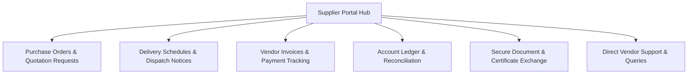

# ORNEXA — SUPPLIER PORTAL MASTER SPECIFICATION
**Authoritative Specification for Bullion Dealers & Component Vendors**
*Version: 3.1.0 (Approved Source of Truth)*
*Last Updated: August 2026*

---

## 1. Portal Identity & Core Objective

The **Supplier Portal** (`/supplier-portal` or `/supplier/*`) provides external vendors (Bullion Dealers, Diamond/Gemstone Merchants, Findings Suppliers, Packaging Vendors) with a dedicated workspace to view Purchase Orders, confirm order acceptance, update delivery schedules, upload tax invoices, and track outstanding settlement payments.

---

## 2. Onboarding & Invitation Flow

Suppliers are onboarded via secure invitations generated directly from **Supplier 360** in the main ERP:
1. **Invite from ERP:** Inventory/Purchasing manager or CEO clicks `[Invite to Supplier Portal]`.
2. **Invitation Link:** Dispatched via Email or WhatsApp.
3. **Password Setup:** Vendor opens link, verifies token, and creates a secure password.
4. **Party Binding:** The account maps strictly to their `supplier_id` (Party record).
5. **Login Options:** Supports standard Email/Phone + Password login, with optional OTP support where configured.

---

## 3. Functional Modules & Workflows

### 3.1 Purchase Orders & Inquiries
- **PO Queue:** View all active purchase orders issued by the manufacturing firm.
- **PO Drilldown:** Detailed list of ordered items, purity/grade specifications, target weights, agreed rates, and delivery deadlines.
- **Actions:**
  - `Accept & Confirm PO` → Confirms vendor acceptance and expected delivery date.
  - `Request Modification` → Proposes alternate rates, dates, or available quantities.

### 3.2 Delivery Dispatch & Tracking
- **Dispatch Notification:** Allows suppliers to record dispatched shipments before physical arrival.
- **Details Captured:** Carrier Name, Tracking / Consignment No, Dispatched Gross/Net Weights, Number of Parcels, Expected Delivery Date.
- **Inward Status:** Tracks physical receipt and weighing verification by the firm's vault team.

### 3.3 Vendor Invoices & Payment Status
- **Invoice Tracking:** View all submitted supplier bills and their settlement status (`Pending Verification`, `Approved`, `Partially Paid`, `Settled`).
- **Payment History:** Detailed log of bank transfers (NEFT/RTGS/IMPS), cheque references, or bullion metal settlements.

### 3.4 Account Ledger & Statement Reconciliation
- Real-time dual-currency statement (Metal Due/Receivable & Cash Due/Receivable).
- Exportable to PDF and CSV for vendor periodic audit reconciliation.

### 3.5 Secure Document & Certificate Exchange
- Upload certified assay reports, Kimberley Process Diamond certificates, Hallmark test sheets, and delivery receipts directly to secure tenant storage.

---

## 4. Security & Access Control

- Authenticated via standard Email/Phone + Password or optional OTP.
- Strict Supabase Row-Level Security: Vendors can only access Purchase Orders, Invoices, and Deliveries explicitly associated with their `supplier_id`.
- Zero access to internal customer orders, manufacturing margins, or other supplier details.
