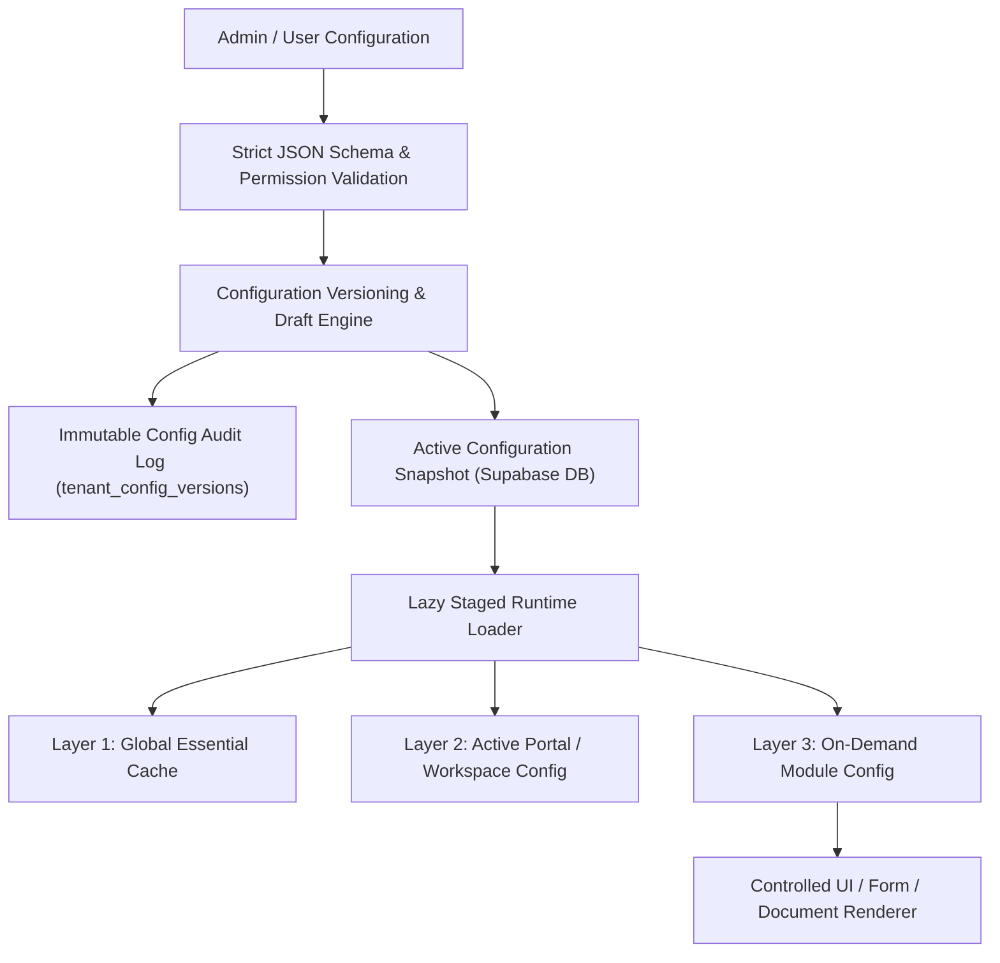
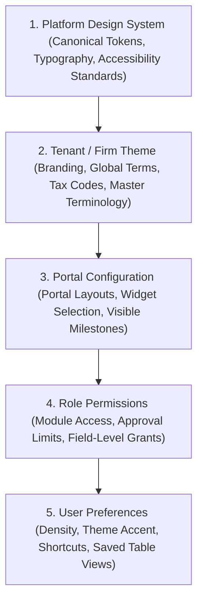

# ORNEXA — UNIVERSAL CUSTOMIZATION MASTER SPECIFICATION
**Authoritative Architectural Specification for Cross-Portal Metadata Configuration, Controlled Customization, and Runtime Engines**
*Version: 3.1.0 (Approved Source of Truth)*
*Last Updated: August 2026*

---

## 1. Universal Customization Philosophy

### 1.1 The Core Operating Principle
> **"EVERY BUSINESS-FACING SURFACE SHOULD BE CONFIGURABLE WITHIN SAFE SYSTEM BOUNDARIES."**
>
> Customization is NOT limited to the main ERP. It applies universally across:
> - **Main ERP Workspace** (`/*`)
> - **CEO Executive Portal** (`/ceo/*`)
> - **Customer Account & Approval Portal** (`/customer/*`)
> - **Karigar / Artisan Workshop Portal** (`/karigar/*`)
> - **Supplier / Vendor Portal** (`/supplier/*`)
> - **Platform Owner / SaaS Control Centre** (`/platform/*`)
> - **Support Portal** (`/support/*`)
> - **All Future Subsystem Portals**

If a tenant wants to customize a legitimate business-facing aspect of any portal or workflow, it must be possible through **declarative configuration without touching source code**.

---

## 2. Configuration vs Source-Code Modification Boundary

No user, tenant administrator, or external consultant receives direct source-code modification access. All system adaptation occurs through a **sandboxed, validated, versioned metadata engine**.

### 2.1 What is Fully Configurable
- Visible and hidden sections across all portals
- Section display order and widget hierarchy
- Field visibility, required state, and custom field labels
- Custom fields (Text, Number, Date, Select, Formula, Image, Scan)
- Dashboard widgets, charts, and metrics
- Navigation menu order, groupings, and quick-action buttons
- Portal actions and workflow triggers
- Status badges, state transitions, and custom milestone labels
- Localized terminology (e.g. Karigar vs Artisan, Hisab vs Settlement, Tapas vs Touch)
- Automated notification templates (WhatsApp, SMS, Email, In-App)
- Document visibility rules per user/portal
- Product catalogue visibility and pricing tiers
- Support contact options and communication channels
- Profile fields and party-specific attributes
- Customer-facing production milestones and tracking stages
- Payment gateway details, bank accounts, and UPI display
- Customer review questions and rating forms
- Tenant branding (Logo, primary brand palette, typography presets) within approved design constraints.

### 2.2 What is Strictly Forbidden (Hard Architectural Guardrails)
- **Zero Security Bypass:** Configuration can never bypass Row-Level Security (RLS) or tenant isolation.
- **Zero Accounting Corruption:** Configuration cannot alter double-entry ledger invariants, posting rules, or trial balance balancing.
- **Zero Historical Tampering:** Modifying a template or field layout never alters posted transactions, generated documents, or historical snapshots.
- **Zero Information Leakage:** Customer and Karigar portal customization can NEVER expose internal profit margins, purchase costs, karigar piece rates, or management audit notes.
- **Zero Arbitrary Code Execution:** No executable JavaScript, raw HTML injection, or unsafe scripting in templates, formulas, or portal layouts.

---

## 3. UI Customization & Inheritance Hierarchy

Ornexa enforces a strict 5-tier inheritance cascade to ensure brand consistency, security, and personal ergonomics:

### 3.1 Inheritance Rules
1. **Platform Layer:** Defines invariant typography scales, spacing grids, contrast ratios, and security bounds.
2. **Tenant Layer:** Configures business identity (firm logo, brand accents, trade terminology, tax rules).
3. **Portal Layer:** Configures portal-specific navigation, widget arrangement, and visibility firewalls.
4. **Role Layer:** Filters available actions and data visibility based on authorized permissions.
5. **User Layer:** Controls personal ergonomics (compact density, favorite shortcuts, saved views) without violating higher-level tenant policies.

---

## 4. Runtime Configuration Performance & Staged Loading

To guarantee instant page load speeds and zero UI stutter, Ornexa forbids downloading massive tenant configuration payloads on initial login.

### 4.1 Staged Loading Pipeline
1. **Stage 1 (Global Essential Config - < 15 KB):** Tenant identity, active theme tokens, user role permissions, active language dictionary. Loaded synchronously during auth initialization.
2. **Stage 2 (Portal / Workspace Config - < 40 KB):** Active portal layout definition, sidebar navigation items, dashboard widget manifests. Loaded concurrently with route transition.
3. **Stage 3 (Module / Transaction Config - On-Demand):** Entity custom fields, document templates, formula snapshot trees, print profiles. Loaded lazily when the specific form or document viewer is opened.

### 4.2 Caching & Invalidation
- All configuration metadata is stored with an immutable `config_version_hash`.
- Client caches configuration in memory and IndexedDB.
- When an administrator publishes a new configuration version, Supabase Realtime emits a `tenant_config_updated` event, prompting background cache invalidation.

---

## 5. Configuration Validation & Rollback Engine

Every configuration change must pass rigorous pre-flight validation before publication:

### 5.1 Pre-Flight Validation Rules
1. **JSON Schema Conformance:** Validates structure against strict Zod schemas.
2. **Circular Dependency Check:** Ensures custom formulas and calculated fields contain no recursion.
3. **Permission Safety Scan:** Checks that no hidden or restricted system fields are exposed to external portals.
4. **Live Simulation / Preview:** Admin can preview the portal or document in a sandboxed staging iframe before publishing.

### 5.2 Versioning & Rollback Workflow
- Every configuration table maintains `status` (`draft`, `published`, `archived`) and `version_number`.
- If an active configuration causes issues in production, authorized administrators can execute `rollback_tenant_configuration(target_version_id)` to instantly revert to the previous verified state.
- Full audit logs capture: `changed_by`, `timestamp`, `diff_snapshot`, and `change_reason`.
